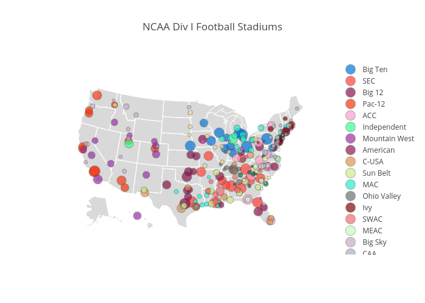

## Project Luther

##### Back story:

Using information we scrape from the web, can we build linear regression models from which we can learn about the topic of our choice.

##### Data:

 * **acquisition**: web scraping
 * **storage**: flat files
 * **sources**: any publicly available information

##### Skills:

   * basics of the web (requests, HTML, CSS, JavaScript)
   * web scraping
   * `numpy` and `pandas`
   * `statsmodels`, `scikit-learn`

### Project Workflow

For my project, I decided to look at what features influence the attendance of NCAA
Division I football game attendance. There are over 250 Division I schools as can be seen below (for the code see the visualization notebook). The larger the circle the larger the stadium.

Specifically, I focused on the win-loss records for all teams and the student enrollment. I also needed stadium information and attendance records. To do this, the code in the code folder was broken up into several files and should be viewed as follows as it is the order in which I organized the data:

1. Part_1_Parsing_NCAA_PDF_Files.ipynb
2. Part_2_Stadium_and_Conferences.ipynb
3. Part_3_ESPN_Win_Loss_Records.ipynb
4. Part_4_Combining_All_Dataframes.ipynb
5. Part_5_Modeling.ipynb
6. Part_6_Visualization.ipynb

The Visualization notebook is only for the visual from the presentation. The presentation
was made in Plotly's slidedeck and saved as Project2.json in the main folder.
